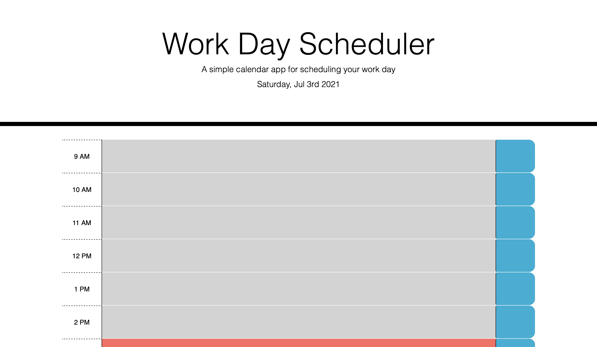
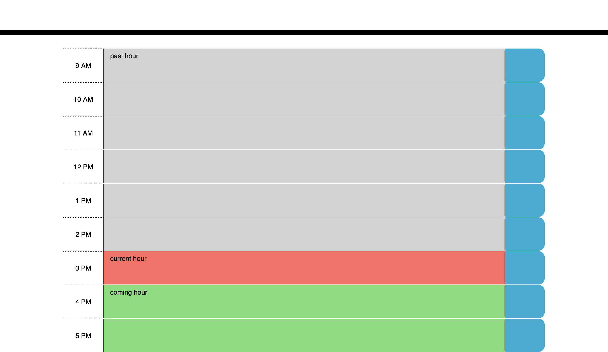

# Work Day Scheduler

This is an simple calendar application that allows a user to save events for each hour of the day. This app will run in the browser and feature dynamically updated HTML and CSS powered by jQuery. 

To acess with date and time, it has built up the [Moment.js](https://momentjs.com/) library.

## Usage
For each individual hour, it has own time block to pass the input in a column format.
This scheduler app is compatible for all the smart devices including tablets, cell phone, and desktops.The local storage is used here to store all the up coming events for the day and it can be saved just clinging save button on the right-end icon. 
For the conveninet and clear look, all the past hours will be turned into light gray color, current hour will turn into red, and coming hours are dispayed as green color. Due to its three different relative color indication, user can review and manage his routine accrodingly.

## Links 

* Link for the deployed application [WeatherDashboard](https://rajesh295-dev.github.io/Weather-Dashboard/)
* Link for the Github repository [Host by Github](https://github.com/Rajesh295-dev/Weather-Dashboard/settings/pages)

## Screenshots:
Before saving any events.

    

After saving events.  

## Contributor:
Rajesh Gautam

- - -
